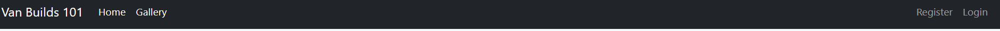
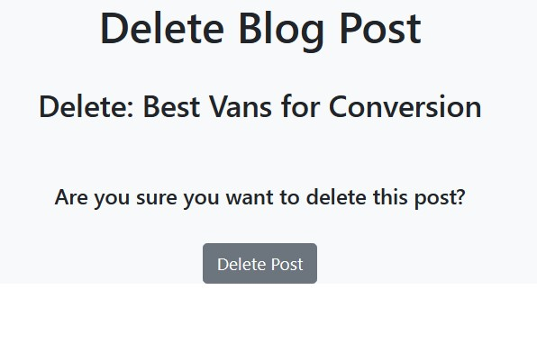

# VAN BUILDS 101

## [Live Site](https://vanbuilds-758ccba3a303.herokuapp.com/)

## [Repository](https://github.com/lukecdev/VanBuilds101)

## Table of contents

 1. [ UX ](#ux) 

# UX

The design philosophy for this site is a easy to navigate and read site. As this site will be hosting articles that provides information, I want to make getting to the particular blog and reading it a minimal effort.

### Site Goal
The goal of the site is to create a platform for online communication. To create an engaging experience to provide a userful edication for the Vanlife community. 

## Project Planning

### Database 

#### Post Model

| id | Field |
|--|--|
| title |CharField|
| slug |SlugField|
| author |CharField|
| excerpt |TextField|
| created on |DateTimeField|
| content |textField|
| featured_image |CloudinaryField|
| status |IntegerField|
| likes |ManyToManyField|

#### Comment Model

| id | Field |
|--|--|
| post |ForeignKey|
| name |CharField|
| email |Emailfield|
| body |TextField|
| created on |DateTimeField|
| approved |BooleanField|

#### Image Model

| id | Field |
|--|--|
| title |CharField|
| slug |SlugField|
| excerpt |TextField|
| image |ImageField|
| author |ForeignKey|
| approved |BooleanField|

# UX Design

## WireFrame

## Design
The design philosophy for this site is a easy to navigate and read site. As this site will be hosting articles that provides information, I want to make getting to the particular blog and reading it a minimal effort.

## Agile Methodology
- The principles of agile methodology were implemented during the project. By assigning user stories to issues and utilizing the GitHub Kanban board, the necessary project goals could be easliy prioritized. Labels were used to fine tune the priority of each user story.

## User Stories

### Users
- I can **view a list of blog posts** so that I can **select which blog post** to read.
- I can **click on a post** so that **I can view the full article text**.
- I can **register an account** so that I can **add posts, comment, and like posts**.
- I can **leave comments on posts** so that **I can engage in discussion with users**.
- I want to be **able to submit a blog post to publish**.
- I can **view the number of likes on a post** to be able **engage with the blog community**.

### Admin
- I can **read, create, edit, and delete posts** so that **I can manage the blog's content**
- I can **approve or disapprove comments** so that **I can filter out objectionable comments**
- I can **delete messages** so that **I can clean out any unwanted comments**
- I can **create draft posts** so that **I can finish writing the content later**

### NINTH User stories
- I can **utilize a map API capability** so that **I can use the map to locate useful related locations**

## Features

### Navbar
Desktop View while user is logged out/unregistered: 

- The desktop navigation consists of a a Home blog and Gallery button. 
- The user is shown the login and register links when not logged in.
- When user is logged in they are shown just the log out link.
- If the user is a superuser they will then also have access to creat a new post. 

### Homepage

### Register

### Sign In

### Sign Out

### Leave a Comment/ Like a Post

### Gallery

## Future Features

# C.R.U.D

## Posting

## Create
- Create Blog Post View

## Read
- Read Post detail

## Update
- Update Blog Post

## Delete
- Delete Blog Post

# Technologies Used
1. Python - Used for the logic in this project
2. Github - For code repository and code version control.
3. Heroku - To deploy the live application.
4. Gitpod - Cload based code editor used.
5. LucidCharts - Used for flow chart creation.
6. Django - Framework used to build this project. Provides a ready installed admin panel and includes many helper template tags that make writing code quick and efficient.
7. Bootstrap - Used as the base front end framework to work alongside Django.
8. Elephant SQL - Was used as the database for this project during development and in production.
9. Cloudinary - Used to host the static files for this project including user profile images.
10. Git - Used for version control throughout the project and to ensure a good clean record of work done was maintained.

## Installed Packages
- django<4' gunicorn
- dj_database_url psycopg2
- dj3-cloudinary-storage
- django-summernote
- django-allauth
- django-crispy-forms
- pillow

# Deployment
To deploy the project through Heroku I followed these steps:

- Sign up / Log in to  [Heroku](https://www.heroku.com/)
- From the main Heroku Dashboard page select 'New' and then 'Create New App'
- Give the project a name - I decided on the devils kitchen and selected EU as that is the closes region to me.
- After this you select select create app. 
- The name for the app must be unique or you will not be able to continue.
- Heroku will create the app and bring you to the deploy tab. 
- From the submenu at the top, navigate to the resources tab.
- Add the database to the app, in the add-ons section search for 'Heroku Postgres', select the package that appears and add 'Heroku Postgres' as the database
- Click on the setting tab
- Open the config vars section copy the DATABASE_URL to the clipboard for use in the Django configuration.
- Inside the Django app repository create a new file called env.py
- within this file import the os library and set the environment variable for the DATABASE_URL pasting in the address copied from Heroku. 
- The line should appear as os.environ["DATABASE_URL"]= "Paste the link in here"
-   Add a secret key to the app using os.environ["SECRET_KEY"] = "your secret key goes here"
-   Add the secret key just created to the Heroku Config Vars as SECRET_KEY for the KEY value and the secret key value you created as the VALUE
-   In the settings.py file within the django app, import Path from pathlib, import os and import dj_database_url
-   insert the line if os.path.isfile("env.py"): import env
-   remove the insecure secret key that django has in the settings file by default and replace it with SECRET_KEY = os.environ.get('SECRET_KEY')
-   replace the databases section with DATABASES = { 'default': dj_database_url.parse(os.environ.get("DATABASE_URL"))} ensure the correct indentation for python is used.
-   In the terminal migrate the models over to the new database connection
---
-   Navigate in a browser to cloudinary, log in, or create an account and log in.
-   From the dashboard - copy the CLOUDINARY_URL to the clipboard
-   In the env.py file - add os.environ["CLOUDINARY_URL"] = "paste in the Url copied to the clipboard here"
-   In Heroku, add the CLOUDINARY_URL and value copied to the clipboard to the config vars
-   Also add the KEY - DISABLE_COLLECTSTATIC with the Value - 1 to the config vars
-   this key value pair must be removed prior to final deployment
-   Add the cloudinary libraries to the list of installed apps, the order they are inserted is important, 'cloudinary_storage' goes above 'django.contrib.staitcfiles' and 'cloudinary' goes below it.
-   in the Settings.py file - add the STATIC files settings - the url, storage path, directory path, root path, media url and default file storage path.
-   Link the file to the templates directory in Heroku TEMPLATES_DIR = os.path.join(BASE_DIR, 'templates')
-   Change the templates directory to TEMPLATES_DIR - 'DIRS': [TEMPLATES_DIR]
-   Add Heroku to the ALLOWED_HOSTS list the format will be the app name given in Heroku when creating the app followed by .herokuapp.com
-   In your code editor, create three new top level folders, media, static, templates
-   Create a new file on the top level directory - Procfile
-   Within the Procfile add the code - web: guincorn PROJECT_NAME.wsgi
-   In the terminal, add the changed files, commit and push to GitHub
-   In Heroku, navigate to the deployment tab and deploy the branch manually - watch the build logs for any errors.
-   Heroku will now build the app for you. Once it has completed the build process you will see a 'Your App Was Successfully Deployed' message and a link to the app to visit the live site.

#### Forking the repository
y forking the GitHub Repository you can make a copy of the original repository to view or change without it effecting the original repository.
You can do this by: 
-  Logging into GitHub or create an account. 
- Locate the repository at  [here](https://github.com/lukecdev/VanBuilds101)
-  At the top of the repository, on the right side of the page, select "Fork" from the buttons available. 
-  A copy of the repository should now be created in your own repository.

#### Create a clone of this repository
Creating a clone enables you to make a copy of the repository at that point in time - this lets you run a copy of the project locally: This can be done by:
- Navigate to [https://github.com/lukecdev/VanBuilds101](https://github.com/lukecdev/VanBuilds101)
- click on the arrow on the green code button at the top of the list of files
- select the clone by https option and copy the URL it provides to the clipboard
- navigate to your code editor of choice and within the terminal change the directory to the location you want to clone the repository to.
- type 'git clone' and paste the https link you copied from github
- press enter and git will clone the repository to your local machine

# Testing

## Manual Testing
> Each user story was manually tested in line with intended functionality on both desktop & mobile.
> As this project was driven by my own User Stories I  felt manual testing was applicable on all logic code.

>If the intended outcome completes then this will be flagged as pass. If it does not then this is a fail.

#### Account Registration Tests
| Test |Result  |
|--|--|
| User can create account | Pass |
| User can log into account| Pass|
|User can log out of account|Pass|

#### User Navigation Tests

| Test |Result  |
|--|--|
|User can navigate to blog posts |Pass|
|User access gallery |Pass|
|SuperUser can access admin panel |Pass|

#### Account Security Tests

| Test |Result  |
|--|--|
|Non logged in user cannot edit posts | Pass |
|Non superuser cannot access admin panel|Pass|

#### Admin Tests

| Test |Result  |
|--|--|
|Admin can add a new Post |Pass|
|Admin can add photos |Pass|
|Admin can edit edit posts |Pass|
|Admin can deleten posts |Pass|

### Google Lighthouse

# Credits
- I used watched this [Youtube Video](https://www.youtube.com/watch?v=B40bteAMM_M&list=PLCC34OHNcOtr025c1kHSPrnP18YPB-NFi) which helped me build the basics of the blog creation for my site.
- I used watched this [Youtube Video](https://www.youtube.com/watch?v=sSquD2u5Ie0) which helped me build elements of the photo gallery.

#  Acknowledgments

- A huge thanks to [Chris Quinn](https://github.com/10xOXR) for his help, suggestions and patiece while I put together this project. 

- Also a huge thanks to the tutors at Code institute for your patience and help in fixing my code issues.
